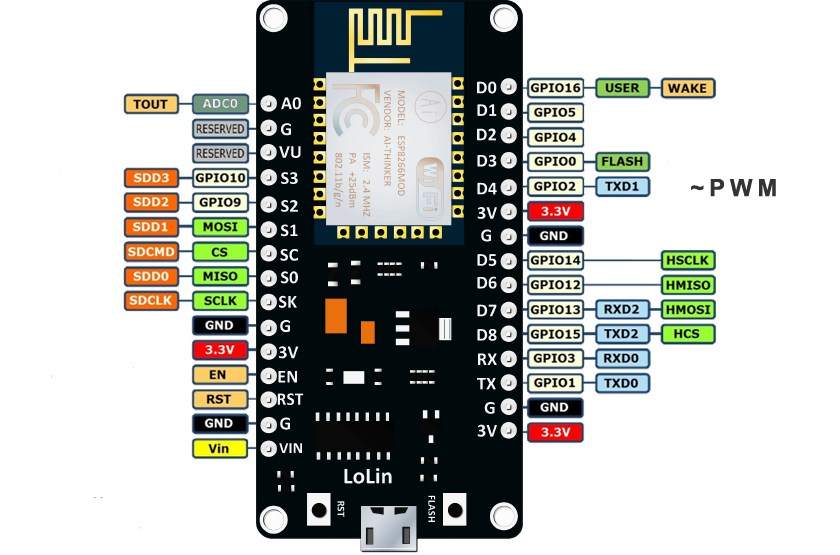

# Android Controlled Door Latch System

## Introduction
A low cost Door Latch System which can be control using an Android App and it even shows you the status of the door if it is open or closed in real time. 

## Technology Stack
1. Firebase
2. Android
3. NodeMCU/Arduino Programming

## Harware Components
1. NodeMCU
2. Jumpers
3. Breadboard
4. Power Supply 12V and 5V both
5. Reed Switch
6. Magnets (we used Neodymium Magnets)
7. Solenoid Latch
8. Relay Module
9. USB to Micro USB cable
10. Multimeter (not necessary but it was handy to quickly check some connections)

## Circuit Diagram
**NodeMCU Pinout** 
**Complete Circuit** 

## Libraries
```
1. ESP8266HTTPClient
2. WiFiClientSecure
3. ESP8266WebServer
4. ArduinoJson
5. FirebaseArduino (v5.0 used in earlier version)
```

## Steps to make this prototype
1. Download and install an [Arduino IDE](https://www.arduino.cc/en/Main/Software)
2. Install above listed libraries
3. Go to File > Preferences. In the "Additional Boards Manager URLs" field, type (or copy-paste) http://arduino.esp8266.com/stable/package_esp8266com_index.json. Don't forget to click OK!
4. Then go to  Tools > Board > Board Manager. Type "esp8266" in the search field. The entry "esp8266 by ESP8266 Community" should appear. Click that entry and look for the install button on the lower right.
5. Select appropriate Board in Tools > Board and appropriate Port.
6. Set up Firebase Project
7. Upload the code in `DoorLatch.ino` after making necessary changes especially the which are labelled like <YOUR_INFO>
8. Make the connections as shown in the circuit diagram.
9. Make sure that the hotspot is on.

## Video
[](http://www.youtube.com/watch?v=rhl77WLnQ0s)


## Key Lessons Learnt
1. Old Relays (shown in picture) turns on when Input Pin is HIGH while the new Relays turns on when the Input Pin is LOW.
2. Difference between HTTPS and HTTP in case of using native firebase APIs

## Authors
- [Vatsal Singhal](https://github.com/vatsalsin)
- [Arya Das](https://github.com/aryadas98)
- [Piyush Chauhan](https://github.com/piyushchauhan/)


